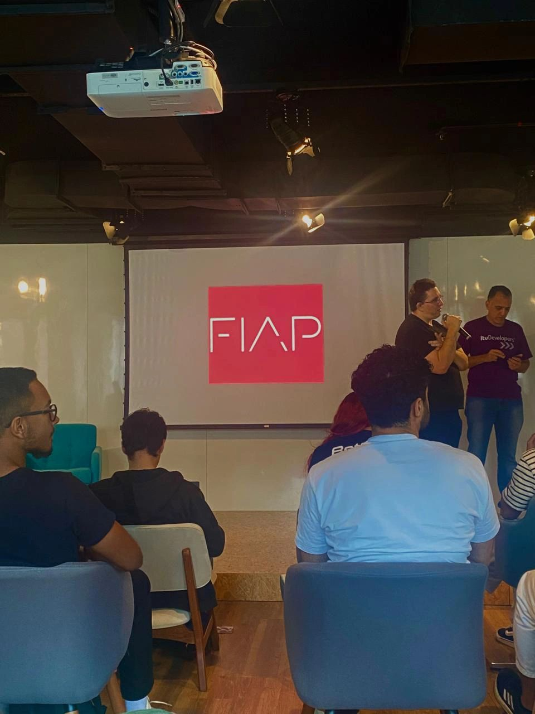
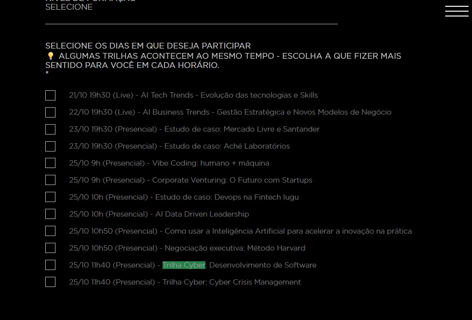

# fiap-conect-summit-seguranca-codigo_2025-10
Informações sobre o Workshop "Implementando Segurança em Código na prática: de aplicações à infraestrutura com GitHub Actions!", realizado durante evento promovido pela FIAP em São Paulo-SP no dia 25/10/2025. - Docker, Kubernetes, Linux, GitHub Actions, .NET, Checkov, KICS, Gitleaks, Kor...

---

## Informações sobre o evento

Título da apresentação: **Detectando Vulnerabilidades em Aplicações - Implementando testes SAST e DAST na prática!**

Evento: **FIAP Connect Summit**

Data: **25/10/2025 (sábado)**

Conteúdo apresentado durante o evento: **https://github.com/renatogroffe/workshop-seguranca-codigo_2025-10**

Tecnologias e tópicos abordados: **Docker, Kubernetes, Linux, GitHub Actions, .NET, Checkov, KICS, Gitleaks, Kor, SAST, DAST Cybersecurity, APIsec scanner...**

Número de participantes: **120 pessoas**

Site do evento: **https://www.fiap.com.br/connect-summit/**

Postagem sobre o evento no LinkedIn: **https://www.linkedin.com/posts/apaivag_indique-pessoas-amplie-seu-networking-e-activity-7383859070480486401-it-q/**

Local: **Av. Paulista, 1106 - 7o andar - Bela Vista - São Paulo-SP - CEP: 01311-000**

Acesse este [**link**](/img/) para visualizar todas as fotos da apresentação.

Esta palestra foi realizada em conjunto com meu amigo **Márcio Nizzola (Microsoft MVP)**.

Deixamos aqui nossos agradecimentos à **Profa. Andréa Paiva**, ao **Prof. José Rubens Rodrigues**, ao **Prof. Thiago Adriano** e demais envolvidos com o evento por todo o apoio para que partipássemos como palestrantes.

---

